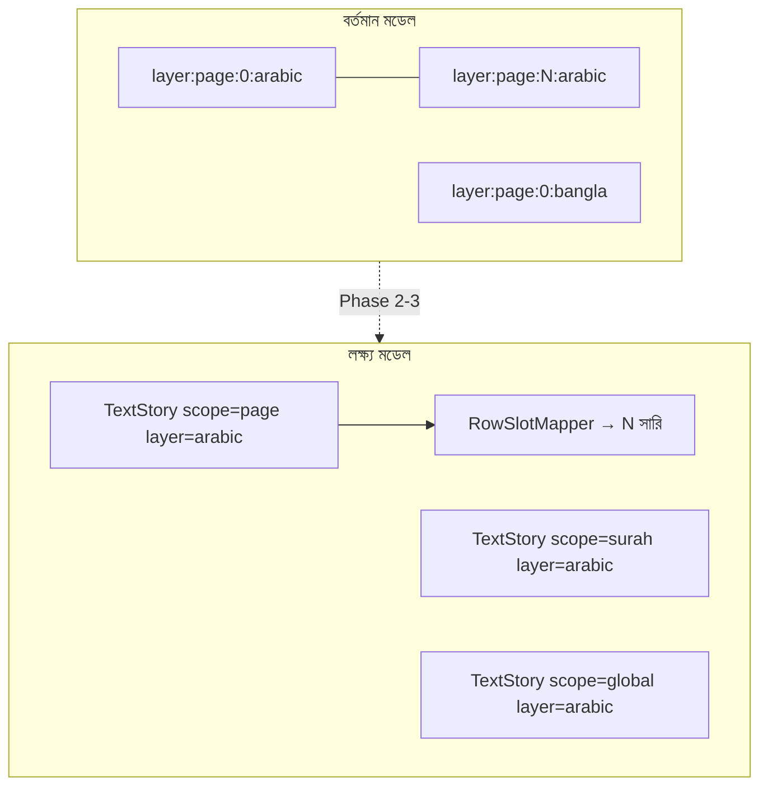

# ফাইনাল প্ল্যান: স্বয়ংসম্পূর্ণ কুরআন মেকার (InDesign-স্তরের এডিটিং)

## বর্তমান অবস্থা (কোড রিভিউ সারাংশ)

### ইতিমধ্যে কাজ করছে (Phase 0 — ভিত্তি)

| ক্ষেত্র | ফাইল | অবস্থা |
|--------|------|--------|
| প্রভাব স্তর (সাধারণ/পেজ/সূরা/পারা/সকল) | [`editorStore.ts`](src/state/editorStore.ts), [`PropertiesPanel.tsx`](src/components/studio/PropertiesPanel.tsx) | সম্পূর্ণ |
| লিংকিং সুইচ (আরবি/বাংলা/সিম্বল) | [`linkingStore.ts`](src/state/linkingStore.ts) | সম্পূর্ণ (গ্লোবাল, পার-স্কোপ নয়) |
| রিফ্লো স্কোপ রেজলিউশন | [`reflowScope.ts`](src/lib/reflowScope.ts), [`scopeTargets.ts`](src/lib/scopeTargets.ts) | সম্পূর্ণ |
| ক্যাসকেড ইঞ্জিন (point + area fixed height) | [`textReflow.ts`](src/lib/textReflow.ts), [`canvasMeasure.ts`](src/lib/canvasMeasure.ts) | ইঞ্জিন প্রায় সম্পূর্ণ |
| টাইপোগ্রাফি → `reflowLayerText` | [`typographyReflow.ts`](src/lib/typographyReflow.ts) | সম্পূর্ণ |
| ওভারফ্লো/বড় পরিবর্তন ডায়ালগ | [`OverflowReflowDialog.tsx`](src/components/studio/OverflowReflowDialog.tsx), [`ScopeImpactWarningDialog.tsx`](src/components/studio/ScopeImpactWarningDialog.tsx), [`CrossPageReflowDialog.tsx`](src/components/studio/CrossPageReflowDialog.tsx) | আংশিক (কপি/কভারেজ অসম্পূর্ণ) |
| সারি-ভিত্তিক ইনলাইন এডিট | [`FabricLines.tsx`](src/components/studio/FabricLines.tsx) `InlineTextEditor` | সম্পূর্ণ কিন্তু আলাদা রিফ্লো পথ |
| পেজ-জোড়া প্যারাগ্রাফ প্রোটোটাইপ | [`UnifiedPageEditor.tsx`](src/components/studio/UnifiedPageEditor.tsx) | **প্রোটোটাইপ** — শুধু `scope !== "general"` + বর্তমান পেজ |
| Area Text 2D split | [`PARAGRAPH_LINKING_PLAN.md`](PARAGRAPH_LINKING_PLAN.md) | ইঞ্জিনে Done; UI-তে auto-height এখনও ব্লক |

### গুরুত্বপূর্ণ ফাঁক (লক্ষ্যের সাথে মিল নেই)



1. **এক প্যারাগ্রাফ লেয়ার প্রতি প্রভাব নেই** — টেক্সট এখনও `layer:{pageId}:{rowIndex}:{arabic|bangla}` কী-তে; InDesign-এর মতো “এক স্টোরি / threaded frames” অবজেক্ট নেই।
2. **`reflowLayerText` vs `InlineTextEditor` দ্বৈত পথ** — টাইপোগ্রাফি `reflowLayerText` ব্যবহার করে; টাইপিং `FabricLines`-এ নিজস্ব `reflowFromAsync` + `surahPageIds: undefined` (স্কোপ সীমা উপেক্ষা)।
3. **`UnifiedPageEditor` অসম্পূর্ণ** — শুধু খোলা পেজ; `reflowFrom`-এ `surahPageIds`/scope enforce নেই; সূরা/পারা/সকলের “এক লেয়ারে সব টেক্সট” নয়।
4. **প্রপার্টিজ প্যানেল সিলেকশন-সিঙ্ক** — `general` + select tool-এ সিলেক্ট অনুযায়ী আরবি/বাংলা ট্যাব/স্লাইডার স্বয়ং স্যুইচ পুরোটা নিশ্চিত নয় (word vs layer vs row)。
5. **লাইন বরাদ্দ vs প্রয়োজনীয় লাইন সংখ্যা** — `planCascade.tailOverflow` UI-তে দেখায় না; “কম/বেশি লাইন লাগবে” নিশ্চিতকরণ সব পথে নেই।
6. **পজিশনিং** — `areaTextHeight.ts` আছে কিন্তু স্কোপ-ওয়াইড প্যারাগ্রাফ থেকে সারি-স্লটে `leading` দিয়ে perfect placement এর সিস্টেম নেই।
7. **পেজ-লাইনের বাইরে অ্যালাইনমেন্ট সতর্কতা** — সূরা-ওপেন/ব্ল্যাংক স্লট ছাড়িয়ে টেক্সট গেলে ডেডিকেটেড “প্রভাব পরিবর্তন” অ্যালার্ট নেই।

---

## লক্ষ্য আর্কিটেকচার

### মূল ধারণা: `TextStory`

প্রতিটি **(scope, layer)** জোড়ার জন্য একটি লজিক্যাল স্টোরি:

```ts
// নতুন: src/lib/textStory.ts (প্ল্যান)
type TextStoryId = `${SelectionScope}:${"arabic"|"bangla"}`;

type TextStory = {
  id: TextStoryId;
  scope: SelectionScope;
  layer: "arabic" | "bangla";
  pageIds: string[];           // resolveTargetPageIds থেকে
  plainText: string;           // সব সারির যোগ (নিয়ম অনুযায়ী separator)
  rowMapping: RowMapping[];    // plainText অফসেট → pageId, rowIndex
};
```

- **রিড:** স্টোরি ← `overridesStore.local` + `pages.lines` (বর্তমান সত্য)
- **রাইট:** স্টোরি এডিট → `RowSlotMapper` → প্রতিটি সারিতে `text` প্যাচ + `reflowLayerText` / ক্যাসকেড
- **ক্যানভাস:** `general` = সারি-ভিত্তিক `InlineTextEditor`; `page|surah|para|global` = `UnifiedStoryEditor` (বর্তমান `UnifiedPageEditor`-এর প্রতিস্থাপন/সম্প্রসারণ)

### রিফ্লো এক পথ

সব টেক্সট পরিবর্তন → `reflowLayerText({ scope, pageId, rowIndex, layer, reason })` — [`textReflow.ts`](src/lib/textReflow.ts) L739-885। `InlineTextEditor` ও `UnifiedStoryEditor` থেকে ডুপ্লিকেট `reflowFromAsync` সরানো।

### স্কোপ enforce নিয়ম

| প্রভাব | `pageIds` | ক্যাসকেড সীমা | এক লেয়ার UI |
|--------|-----------|---------------|--------------|
| general | `[activePage]` | শুধু নির্বাচিত সারি (লিংক ON হলে পরের সারি পর্যন্ত **এক পেজ**) | সারি ইনলাইন |
| page | খোলা পেজ | সেই পেজের সব বৈধ সারি | এক আরবি + এক বাংলা ফ্রেম |
| surah | distribution.surah | সূরার সব পেজ | এক আরবি + এক বাংলা (মাল্টি-পেজ স্টোরি) |
| para | distribution.para | পারার সব পেজ | এক আরবি + এক বাংলা |
| global | সব পেজ | সম্পূর্ণ মুসহাফ | এক আরবি + এক বাংলা |

লিংক **OFF** → `effectiveReflowScope` অনুযায়ী `cascade: false` (বর্তমান [`reflowScope.ts`](src/lib/reflowScope.ts)) — ওভারফ্লো ক্লিপ + টোস্ট।

---

## বিস্তারিত উদাহরণ (মূল ফিচার — রিভিউ করার জন্য)

**সেটআপ:** পেজ `vpage-12` খোলা, সিলেক্ট টুল, প্রভাব = **পেজ**, আরবি **লিংক ON**, Area Text নয় (point)।

**ধাপ ১ — সিলেকশন ও প্যানেল**  
সারি ৪-এর আরবি লেয়ার ক্লিক → `selection = { kind: "layer", layerKind: "arabic", ... }` → PropertiesPanel-এ আরবি ফন্ট/লিডিং স্লাইডার সক্রিয়; স্কোপ চিপ “পেজ” হাইলাইট।

**ধাপ ২ — টাইপ টুলে লাইন এডিট**  
`T` → সারি ৪ ইনলাইন এডিট → ব্যবহারকারী একটি দীর্ঘ আয়াতের মাঝে শব্দ যোগ করে সারির প্রস্থ ছাড়িয়ে যায়।

**ধাপ ৩ — লিংক ON ক্যাসকেড**  
`checkOverflow` → `splitToFit` → অতিরিক্ত টেক্সট সারি ৫-এ যায়; সারি ৫ পূর্ণ হলে ৬… (শুধু `vpage-12`-এর `pageIds` — Phase 1-এ enforce)। পিছের সারির শব্দ এগিয়ে এলাইন হয় (back-fill যখন স্পেস খালি)।

**ধাপ ৪ — প্রভাব = পেজ, ইউনিফাইড মোড**  
টাইপ টুল + পেজ স্কোপ → `UnifiedStoryEditor` (বর্তমান [`UnifiedPageEditor`](src/components/studio/UnifiedPageEditor.tsx)) — পেজের **সব** আরবি এক contenteditable ফ্রেমে; বাংলা আলাদা ফ্রেম। কমিটে `TextStory` → `RowSlotMapper` → প্রতিটি সারিতে বণ্টন + `reflowLayerText`।

**ধাপ ৫ — ওভারফ্লো নিশ্চিতকরণ**  
যদি বরাদ্দকৃত ৯টি স্লটের চেয়ে বেশি লাইন দরকার → `OverflowReflowDialog` / `CrossPageReflowDialog`: “মোট X সারি ওভারফ্লো, Y পেজ প্রভাবিত — রিফ্লো করবেন?”

**ধাপ ৬ — প্রভাব পরিবর্তন সতর্কতা**  
পেজ স্কোপে justify/leading বাড়ালে টেক্সট `surah-open` বা `blank` স্লটে ঢুকতে চাইলে → নতুন `LayoutImpactDialog`: “নির্দিষ্ট লাইনের বাইরে অবস্থান — প্রভাব বদলাবেন?”

**ধাপ ৭ — শব্দ সিলেকশন (সকল প্রভাব)**  
`scope = global`, আরবি শব্দ “الرحمن” সিলেক্ট → `buildScopedKeys` ([`scopeTargets.ts`](src/lib/scopeTargets.ts) L66-84) → WordPanel-এ রঙ/ট্র্যাকিং → মুসহাফ জুড়ে মিলে যাওয়া শব্দগুলোতে প্যাচ।

**ধাপ ৮ — সূরা/পারা/সকল এক লেয়ার**  
`scope = surah` → এক আরবি স্টোরি (সূরার সব পেজের টেক্সট `\n` বা row separator দিয়ে); ক্যানভাসে খোলা পেজে ওভারলে এডিট, কমিটে সূরার সব পেজে ম্যাপ।

এই উদাহরণই **পরীক্ষার চেকলিস্ট** — প্রতিটি ধাপ শেষ হলে “হ্যাঁ, InDesign-এর মতো কাজ করছে” বলা যাবে।

---

## ইমপ্লিমেন্টেশন ধাপ (বর্তমান প্রোগ্রেসের **পর**)

### Phase 1 — রিফ্লো পাইপলাইন একীকরণ (১–২ সপ্তাহ)

**লক্ষ্য:** টাইপিং ও টাইপোগ্রাফিতে একই আচরণ।

- [`FabricLines.tsx`](src/components/studio/FabricLines.tsx) `InlineTextEditor`: `checkOverflow`, Enter, backspace merge → `reflowLayerText({ scope: editorScope, ... })`।
- `reflowFromAsync`-এ **`surahPageIds: eff.pageIds`** পুনরায় enforce; “decouple” কমেন্ট সরানো বা ডকুমেন্টেড ফ্ল্যাগ।
- [`overflowDetector.ts`](src/lib/overflowDetector.ts): `splitToFitArea` + `leading` সহ area row; stale “no cascade” কমেন্ট সরানো।
- [`overridesStore.ts`](src/state/overridesStore.ts) L33-34 কমেন্ট আপডেট (area এখন cascade করে যখন linked + fixed height)।
- `planCascade.tailOverflow > 0` হলে ডায়ালগে “স্কোপের বাইরে অতিরিক্ত টেক্সট” দেখানো।

**সমাপ্তি:** general-এ লাইন-বাই-লাইন + linking cascade; typography ও typing একই সীমা।

---

### Phase 2 — TextStory + RowSlotMapper (২–৩ সপ্তাহ)

**নতুন মডিউল:**

- `src/lib/textStory.ts` — `buildStory(scope, layer, anchorPageId)`, `storyToRowPatches(story, pages)`
- `src/lib/rowSlotMapper.ts` — `getDomSlots` + `skipSlots` (সূরা-ওপেন/ব্ল্যাংক) অনুযায়ী বরাদ্দ; অতিরিক্ত/কম সারি → `SlotDeltaPlan`

**নিয়ম:**

- সূরা-ওপেন পেজ: `startAt = 3` ([`scopeTargets.ts`](src/lib/scopeTargets.ts) L118-119) — ম্যাপার একই লজিক।
- Separator: সারি সীমানায় `\u200B` বা `\n` (ইনডিজাইন paragraph break vs soft break — কনফিগ একবার ঠিক করে ফ্রিজ)।
- ইতিহাস: `captureHistory` এক স্টোরি কমিট = এক এন্ট্রি (`historyStore` silent fan-out)。

---

### Phase 3 — UnifiedStoryEditor (প্রভাব-ভিত্তিক প্যারাগ্রাফ) (২–৩ সপ্তাহ)

**[`UnifiedPageEditor.tsx`](src/components/studio/UnifiedPageEditor.tsx) → `UnifiedStoryEditor.tsx`:**

| স্কোপ | এডিটর আকার | কমিট সীমা |
|-------|------------|-----------|
| page | বর্তমান পেজ ফুল-ফ্রেম | `resolveTargetPageIds("page")` |
| surah | খোলা পেজ ওভারলে + স্টোরি ব্যাজ “সূরা X” | সূরার সব পেজ |
| para | দ্বৈত হাইলাইট (আছে) + স্টোরি এডিট | পারার সব পেজ |
| global | ফুল আর্টবোর্ড ওভারলে (যতটা সম্ভব) | সব পেজ |

- [`FabricLines.tsx`](src/components/studio/FabricLines.tsx) L120-121: `scope !== "general"` শর্ত রাখা, কিন্তু **স্টোরি বিল্ড scope অনুযায়ী**।
- general-এ পুরনো সারি `InlineTextEditor` (লাইন-বাই-লাইন)।
- কমিট: `useLargeChangeGuard` + `OverflowReflowDialog` ইন্টিগ্রেশন।

---

### Phase 4 — Perfect positioning (লাইন হাইট) (১–২ সপ্তাহ)

- প্রতিটি সারি স্লটের **লক্ষ্য Y** = `layout[row].ay/by` ([`FabricLines`](src/components/studio/FabricLines.tsx) `RowBox`)।
- স্টোরি থেকে সারি-ভাগ করার পর প্রতিটি `layer:*` প্যাচে:
  - `leading` (px) = `slotHeight` বা `(nextRowY - currentRowY) / fontPx`
  - প্রয়োজনে `dy` মাইক্রো-অ্যাডজাস্ট (±১–২px) — `baseline` ফিল্ড ব্যবহার
- [`areaTextHeight.ts`](src/lib/areaTextHeight.ts) + [`canvasMeasure.ts`](src/lib/canvasMeasure.ts) `splitToFitArea`-এর leading এক সূত্রে।
- Area Text ফ্রেম: `areaHeight = slotHeight` (Wand “Fit to slot” বাটন — [`PropertiesPanel`](src/components/studio/PropertiesPanel.tsx) CharacterPanel)।

---

### Phase 5 — সিলেকশন ↔ PropertiesPanel সিঙ্ক (১ সপ্তাহ)

- Select tool: `layer` / `row` / `word` সিলেক্ট → স্বয়ং `activeLayerKind` ইনফার (আরবি স্ট্রিপ ক্লিক → আরবি স্লাইডার)।
- Type tool: `CharacterPanel` শুধু `kind === "layer"`; word → `WordPanel` (বর্তমান বিভাজন বজায়)।
- স্কোপ চিপ পরিবর্তন → হাইলাইট `buildVisibleLayerKeys` / `buildVisibleDualLayerKeys` ([`scopeTargets.ts`](src/lib/scopeTargets.ts)) — ক্রস-পেজ সূরা/পারায় “কতগুলো সারি প্রভাবিত” কাউন্টার প্যানেলে।

---

### Phase 6 — নিশ্চিতকরণ ও প্রভাব সতর্কতা (১ সপ্তাহ)

**নতুন/সম্প্রসারিত ডায়ালগ:**

| ট্রিগার | ডায়ালগ | কাজ |
|---------|---------|-----|
| `estimatedRows >= 20` বা surah/para/global | `ScopeImpactWarningDialog` | আছে — threshold টিউন |
| typography overflow | `OverflowReflowDialog` | area row যোগ |
| cross-page Enter/paste | `CrossPageReflowDialog` | scope লেবেল ঠিক করা |
| `tailOverflow` / slot shortage | **নতুন `SlotAllocationDialog`** | “আরও X সারি লাগবে — পরের পেজে ঠেলবেন?” |
| টেক্সট blank/open স্লটে | **নতুন `LayoutImpactDialog`** | পেজ প্রভাব নির্দিষ্ট বার্তা |

[`useLargeChangeGuard.ts`](src/hooks/useLargeChangeGuard.ts) — সব কমিট পথে `request()` ব্যবহার নিশ্চিত করা।

---

### Phase 7 — Area linking সম্পূর্ণতা (PARAGRAPH_LINKING_PLAN বন্ধ)

[`PARAGRAPH_LINKING_PLAN.md`](PARAGRAPH_LINKING_PLAN.md) অবশিষ্ট:

- `areaHeight === null` → ইঞ্জিন point-like fallback (আছে); **FabricLines** `checkOverflow` early return সরিয়ে একই নিয়ম।
- লিংক ON + fixed `areaHeight` → সারি-থেকে-সারি threaded area (InDesign linked frames)।
- UI: Area বাটন টুলটিপ আপডেট (“লিংক ON হলে ক্যাসকেড হয়”)।

---

### Phase 8 — QA ও গ্রহণযোগ্যতা (চূড়ান্ত)

**চেকলিস্ট (উপরের উদাহরণ + নিচ):**

- [ ] general + link OFF → ওভারফ্লো ক্লিপ, অন্য সারিতে যায় না
- [ ] general + link ON → এক পেজের মধ্যে cascade + back-fill
- [ ] page → এক আরবি/এক বাংলা ফ্রেম, কমিট后 সব সারি সঠিক স্লটে
- [ ] surah/para/global → স্কোপ সীমায় cascade; বাইরে গেলে confirm
- [ ] word select + global → সমান শব্দ সব জায়গায় প্যাচ
- [ ] leading/align scoped patch → overflow detect → confirm → rebuild
- [ ] undo/redo স্টোরি কমিটে এক এন্ট্রি
- [ ] `isReflowing` UI ব্লক না করে এডিট হারায় না

---

## প্রয়োজনীয় নিয়ম (Rules)

1. **এক সত্য (Single source of truth):** সারি টেক্সট = `overridesStore.local[layerKey].text` ?? `pages.lines`; স্টোরি শুধু ভিউ/এডিট স্তর, কমিটে সারিতে ভাঙা।
2. **লিংক OFF = কোনো ক্যাসকেড নয়** — clip + বাংলা টোস্ট ([`textReflow.ts`](src/lib/textReflow.ts) L799-806)।
3. **স্কোপ সবসময় explicit** — `reflowLayerText`-এ `scope` পাস বাধ্য; race এড়াতে ([`textReflow.ts`](src/lib/textReflow.ts) L758-762)।
4. **টেক্সট প্যাচ কখনো scope fan-out করে না** ([`overridesStore`](src/state/overridesStore.ts)) — শুধু টাইপোগ্রাফি/অফসেট `patchScoped`।
5. **বৈধ সারি ছাড়া কোথাও টেক্সট রাখা যাবে না** — `findNextValidRow` / `getDomSlots` মেনে চলা।
6. **বড় অপারেশন async** — `reflowFromAsync` + `buildProgress` ([`reflowStore.ts`](src/state/reflowStore.ts))।
7. **ইতিহাস:** fan-out期间 `beginSilent` / এক এন্ট্রি ([`historyStore.ts`](src/state/historyStore.ts))।
8. **SSR-safe measure** — [`canvasMeasure.ts`](src/lib/canvasMeasure.ts) guard বজায়।

---

## মাইলস্টোন ও “স্বয়ংসম্পূর্ণ” সংজ্ঞা

| মাইলস্টোন | ব্যবহারকারী দেখবে |
|-----------|------------------|
| M1 (Phase 1) | লিংক ON-এ লাইন এডিট = টাইপোগ্রাফির মতোই reflow |
| M2 (Phase 2-3) | পেজ/সূরা/পারা/সকল = এক আরবি + এক বাংলা প্যারাগ্রাফ এডিট |
| M3 (Phase 4-6) | সঠিক স্লট পজিশন + সব confirm + শব্দ সিলেক্ট |
| M4 (Phase 7-8) | Area threaded + সম্পূর্ণ QA |

**স্বয়ংসম্পূর্ণ কুরআন মেকার** = M4 + বর্তমান টাজউইদ/পেজ বিল্ড/ইতিহাস/এক্সপোর্ট ([`reflowStore`](src/state/reflowStore.ts), [`pages.ts`](src/data/pages.ts)) অক্ষত।

---

## ঝুঁকি ও সিদ্ধান্ত

- **বড় সূরা/global এডিট:** অবশ্যই dry-run + confirm; ব্যাচ `reflowFromAsync` (ইতিমধ্যে আছে)।
- **Unified global overlay:** সম্পূর্ণ DOM এক ফ্রেমে না — ভার্চুয়ালাইজড স্টোরি এডিটর (textarea + mirror) বিবেচনা যদি পারফরম্যান্স সমস্যা হয়।
- **Word = global identical text:** বর্তমান `buildScopedKeys` একই আয়াত শব্দ সব জায়গায় ধরে — ভুল positive হলে পরে verse-id-aware matching।

---

## এক্সিকিউশন ক্রম (রিভিউ 후 অনুমোদন)

1. Phase 1 (কম ঝুঁকি, উচ্চ প্রভাব)  
2. Phase 2 → 3 (মূল ফিচার)  
3. Phase 4 → 5 → 6 (পোলিশ)  
4. Phase 7 → 8 (বন্ধ ও QA)

প্রতিটি Phase শেষে উপরের **উদাহরণের সংশ্লিষ্ট ধাপ** ম্যানুয়াল টেস্ট — তারপর পরের Phase।
